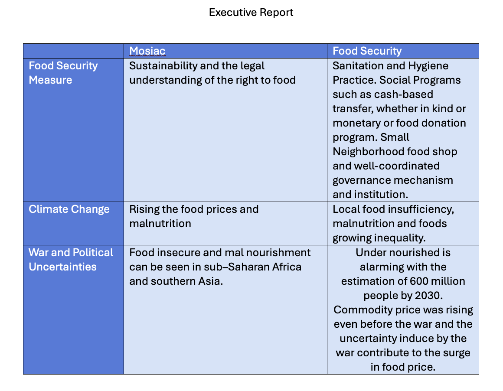

# Hackathon
    San Jose State University. CMPE274, Spring 2024

## Topic:
    Enterprise Business Intelligene Platform RAG for Market Research and Food Security

## Over view solutions:
    In this section, we developed information retrieval systems where the application can retrieve information from the submission documents. It could be images, pdf, word docs, or text files. The application then use deep learning models to extract data from the submission documents and return it to the users. 

## Technical Aspect
Colab Notebook is available for preview download, and the final solution will be implemented using Python programming languages, MatplotLib, Haystack, and Transformer.

## Data Visualization

The initial part of the project involves visualizing the Producer Price Index by Commodity for Chemicals and Allied Products, particularly phosphoric acid and phosphate fertilizers. This visualization is achieved through the use of Python's Plotly library, allowing for an interactive graphical representation of price trends over time. The data is sourced from a CSV file stored on Google Drive, showcasing the integration of cloud storage with data analytics.

Key Features of the Visualization:

    ●	Time-range selectors to view data from different periods.
    ●	Interactive line graphs displaying price trends.
    ●	Dynamic loading of data from Google Drive to ensure real-time accuracy and accessibility.

This visualization serves as a foundational tool for analysts and stakeholders to observe market trends and make informed decisions regarding commodity investments and procurement.

## Question answering system

The next phase involves the creation of an advanced question-answering system that utilizes a combination of Elasticsearch for document storage and retrieval, and the Haystack framework for processing and answering natural language queries.
Technical Implementation:

1.	Document Storage and Retrieval: The system uses Elasticsearch to index and retrieve documents. These documents include detailed reports and PDFs related to food security and the agriculture sector.
2.	PDF Processing: Documents are converted from PDF to text format, allowing for further processing and indexing.
3.	Question Answering: Utilizes the deepset/roberta-base-squad2 model within Haystack to answer queries. This model is specifically fine-tuned for the question-answering tasks on the SQuAD dataset.
4. Text Summarization: Utilized Transformer "t5-small" for text summarization to ensure the extracted information is complete and in human readable format instead of json, xml, or others.

## Executive Report

The executive summary contains the information that has been extracted from the chatbot system above.

## Citation

1. https://docs.haystack.deepset.ai/docs/intro
